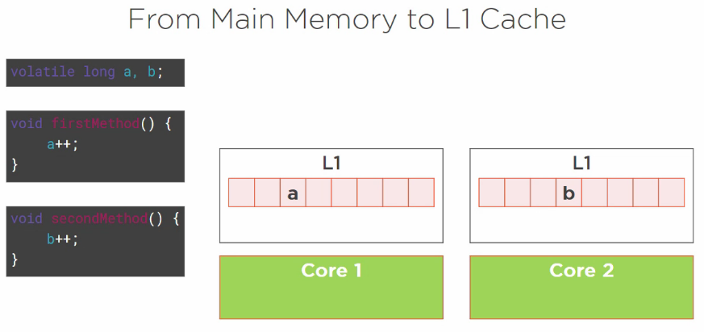
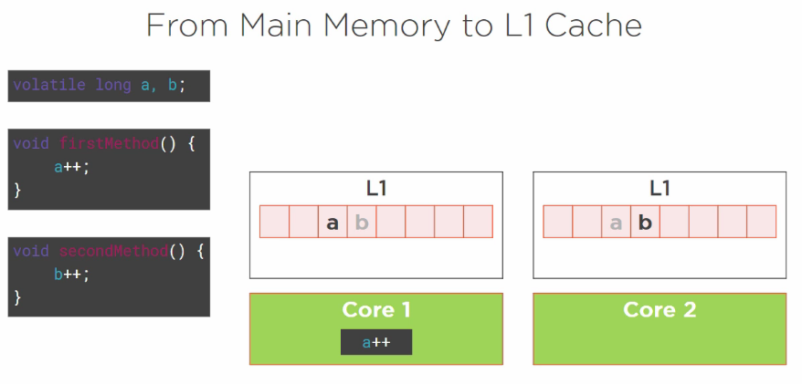
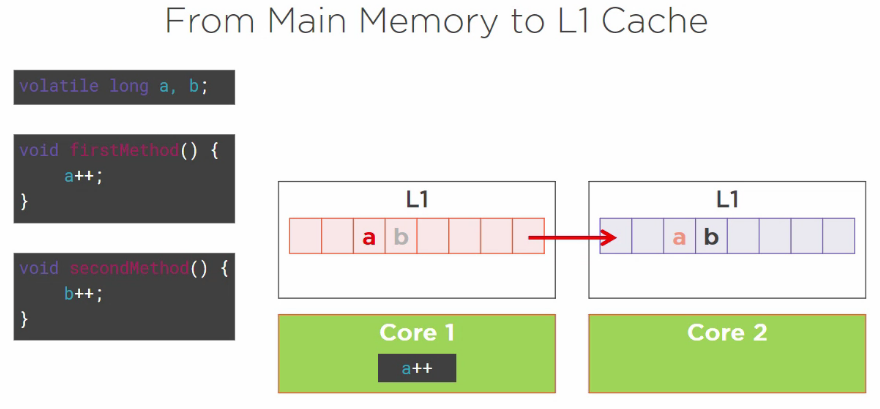
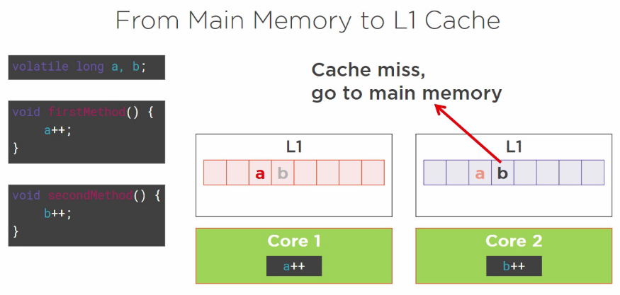

# [技术备忘录](../README.md) | [Java](README.md) | 并发和多线程

## 目录
  1. [What is concurrency？](#what-is-concurrency)

## 问题
### 1. What is a Thread?
* A thread is defined at the Operating System level
  * From the developer point of view, a thread is a set of instructions that I'm going to write in my application, and execute in a certain way.
  * An application can be composed of several threads.
  * Different threads can be executed "at the same time"
  * The Java Virtual Machine works with several threads (GC, JIT, ...)
* The most basic way to create threads in Java is to use the Runnable Pattern.
  1) Create an instance of Runnable
  2) Pass it to the constructor of the Thread class
  3) Call the start() method of this Thread object
  ```java
  Runnable runnable = () -> {
    String name = Thread.currentThread().getName();
    System.out.println("I am running in thread " + name);
  }
  Thread thread = new Thread(runnable);
  thread.start();
  ```
  The code above can be written in one line:
  ```java
  new Thread(() -> {
    String name = Thread.currentThread().getName();
    System.out.println("I am running in thread " + name);
  }).start();
  ```  

### 1. What is concurrency？<a name="what-is-concurrency"></a>[↑](#top)
* Concurrency: "The art of doing several things at the **same** time"
  * What does the word "same" mean in this context?
    > This context has changed from the monocore CPUs to the multicore CPUs.
    > 
    > In the monocore CPU era, we feel things happen at the same time because things are happening fast, but in CPU level, things are in fact executed sequentially.
    > 
    > In the multicore CPU ear, things are really happening at the same time.

### 2. When will the scheduler pause a thread?
1) The CPU should be shared equally among threads
2) The thread is waiting for some more data
3) The thread is waiting for another thread to do something(e.g. to release a resource)

### 2. What does correct code mean in the concurrent world? 

### 3. How to improve your code by leveraging multi-core CPUS?
* How we can improve existing code or new code by leveraging multi-core CPUs - improving the performance of our code.
  * See how to write code, how to implement patterns - esp. the singleton pattern.

### 4. Race condition, synchronization, volatility
> Race condition deals with the access of data concurrently.
  * What does it mean accessing data concurrently?
    > It means that two different threads might be reading the same variable,
    > the same field defined in a Java class, or the same array.
  * Accessing data concurrently may lead to issues
  * Race condition means that two different threads are trying to read and write the same variable at the same time.
    * An example: The problem with a singleton pattern implementation in the concurrent world:
      ```java
      public class Singleton {
        private static Singleton instance;
        private Singleton() {}
        public static Singleton getInstance() {
          if (instance == null) {
            instance = new Singleton();
          }
          return instance;
        }
      }
      ```
      > What is happening if two threads are calling getInstance() at the same time?
      
      > Thread T1 and Thread T2 will both create an Singleton instance respectively, and T1 will erase the instance created by T2
  * How to solve the problem caused by race condition?
    * The answer is: Synchronization
      * Synchronization prevents a block of code to be executed by more than one thread at the same time
        > From a technical point of view, it will prevent the thread scheduler to give the hand to a thread that wants to execute the synchronized portion of code that is being executed by another thread.
      * How does it work technically?
        * very simple - just add the synchronized keyword on the declaration of the method
          ```java
          public class Singleton {
            private static Singleton instance;
            private Singleton() {}
            public static synchronized Singleton getInstance() {
              if (instance == null) {
                instance = new Singleton();
              }
              return instance;
            }
          }
          ```
          > For synchronization to work, we need a specail, technical object that will hold the key.
          > 
          > In fact, every Java object can play this role. 
          > s
          > This key is also called a monitor.

        * How can we deignate the object used to hold the key for synchronization?
          > There are several cases to consider:
          * A synchronized static method uses the class as a synchronization object.
          * A synchronized non-static method uses the instance as a synchronization object
          * A third possibility is to use a dedicated object to synchronize.
            ```java
            public class Person {
              private final Object key = new Object();
              public String init() {
                synchronized(key) {
                  // do some stuff
                }
              }
            }
            ```
            > It is always a good idea to hide an object used for synchronization, whether we are in a static context or not.

  * Reentrant locks
    * In Java, locks are reentrant.
      > When a thread holds a lock, it can enter a block synchronized on the lock it is holding
  * Deadlock
    * A deadlock is a situation where a thread T1 holds a key needed by a thread T2, and T2 holds a key needed by T1.
      > The JVM is able to detect deadlock situations, and can log information to help debug the application. 


### 5. Visibility, false sharing, happens-before link

* What is *visibility*?
  > Bound to the way multicore CPUs work
  * Synchronization and visibility
    > Synchronization is about protecting a block of code, which might be a whole method or some portion of a method. It guarantees this code is executed by only one thread at a time.
    > * Synchronization is about preventing two threads from executing this piece of code at the same time. It is there to prevents race condition.
    > look at the code below:
    > ```java
    > public void consume() {
    >   synchronized(lock) {
    >     while (isEmpty(buffer)) {}
    >     buffer[--count] = 0;
    >   }
    > }
    >
    > public void produce() {
    >   synchronized(lock) {
    >     while (isFull(buffer)) {}
    >     buffer[count++] = 0;
    >   }
    > }
    > ```
    > 20 years ago, when CPU had no cache, this code was working fine.
    > 
    > But nowadays, things do not work like that any more! 
    > A CPU does not read a variable from the main memory, but from a cache.
    > 
    > 
    
    * Visibility is about informing the other caches of my CPU that a variable has been modified and that write value is in one of the caches of the CPU and should not be fetched from the main memory.
      > A variable is said visible, if the writes made on it are visible, which means the reads made on this variable are going to return the correct value.
      > * **All the synchronized writes are visible.** That is all the modification of variables made within the boundary of a synchronized block, are visible. 


* What is the "[happens before](https://docs.oracle.com/en/java/javase/12/docs/api/java.base/java/util/concurrent/package-summary.html#MemoryVisibility)" link?
> The "happens before" link is an abstract notion introduced in Java to help us order the read and the write operations on a multicore CPU.
> * There are multiple references to happens-before in the Javadoc, esp. several special classes from the java.util.concurrent package, such as [BlockingQueue](https://docs.oracle.com/en/java/javase/12/docs/api/java.base/java/util/concurrent/BlockingQueue.html), [CyclicBarrier](https://docs.oracle.com/en/java/javase/12/docs/api/java.base/java/util/concurrent/CyclicBarrier.html), [CountDownLatch](https://docs.oracle.com/en/java/javase/12/docs/api/java.base/java/util/concurrent/CountDownLatch.html)

* The Java Memory Model 
> * Multicore CPU brings new problems:
>   * Read and writes can really happen at the same time.
>   * A given variable can be stored in more than one place.
> * Visibility means "a read should return the value set by the **last** write".
>   * What does the word last mean?
>     * We need a timeline to put read and write operations on.
> 
> 
> * How can we set up a "happens-before" link?
>   * There is no such keyword in the Java language...
>   * A "happens before" link exists between all synchronized or volatile write operations and all synchronized or volatile read operations that follow.
> 
> Example 1: no happens before
> 
> 
> Example 2: synchronization
> 
> 
> Example 3: volatile
> 
> 
> Example 4: A more complex Exmaple
> 
> 
> 
> 
> From a concurrent programming point of view, this code is buggy because I cannot tell in advance what value r2 will receive.

* Summary:
  * Synchronization - Guarantees the exclusive execution of a block of code
  * Visibility - Guarantees the consistency of the variables
 
* **All shared variables should be accessed in a synchronized or a volatile way.**
  > If you see a piece of code that is read or written by more than thread and that is neither synchronized nor volatile then you have a race condition and a bug in your code.

* What is "False sharing"?
  > False sharing happens becasue of the way the CPU caches work.
  > 
  > It is a side effect, that can have a tremendous effect on performance.
  >
  > The cache is organized in lines of data. 
  > * Each line can hold 8 longs (64 bytes). 
  > * When a visible variable is modified in an L1 cache, all the line is marked "dirty" for the other caches.
  > * A read on a dirty line triggers a refresh on the whole line, not just on the variable that has been modified. 
  > An example shown as below:
  > 
  > 
  > 
  > 
  > 
  > 
  > 
  > 
  > 
  >
  > * False sharing happens in an invisible way, because when we write some code and when we write a class, we have no idea of how the class and its field are laid out in memory. It is hard to predict, but it is with no doubt hitting the performances of our application.
  >   * There are workarounds to prevent false sharing from happening in very simple case.
  >     * Below is an example to work around it by variable padding.
* What does *volatile* mean?
 
  * How it can be used?
  * Why it should be used sometimes on the declaration of fields?

* The impact of *false sharing* on code
  > The side effect of the way the multicore CPUs work - that is, CPU calls caches are organized, which is called "false sharing".

--------------------------------------------------

### 6. How to implement the producer/consumer pattern using wait/notify?
* The Runnable pattern
  > This is the first pattern used to launch threads in Java.
  > 
  > Introduced in Java 1.0
  >
  > Other patterns have been introduced in Java 5, in the java.util.concurrent API
  * How to launch a thread?
    > A thread executes a task. In Java 1, the model for a task is the Runnable interface
    > The Runnable pattern launches a thread in three steps:
    > 1. create an instance of Runnable
    > 2. create an instance of Thread with the Runnable instance as a parameter
    > 3. Launch the thread
      ```java
      @FunctionalInterface
      public interface Runnable {
        void run();
      }
      ```

      ```java
      Runnable task = () -> System.out.println("Hello world!");
      Thread thread = new Thread(task);
      thread.start();
      ```
      * How to know in which thread a task is executed?
        > The [Thread.currentThread()](https://docs.oracle.com/en/java/javase/12/docs/api/java.base/java/lang/Thread.html#currentThread()) static method returns the current thread.
        ```java
        Runnable task = () -> {
          // Print out the name of the thread running this task.
          System.out.println(Thread.currentThread().getName());
        }
        ```
  * How to stop a Thread?
    > Stopping a Thread is more tricky than it seems. 
    > 
    > There is ~~Thread.stop()~~ method, but it should not be used. This method was introduced in the first version of the Thread class before the people who wrote it realized that it was a wrong idea to create such a method. It is there for legacy, backward compatiblity reasons.
    > 
    > The right pattern is to use the [interrupt()](https://docs.oracle.com/en/java/javase/12/docs/api/java.base/java/lang/Thread.html#interrupt()) method.
    > 
    > Note: The interrupt() method will not stop a thread, but merely send a signal to the task the thread is running telling it that it it time for this task to stop itself. The code of the task should call [isInterrupted()](https://docs.oracle.com/en/java/javase/12/docs/api/java.base/java/lang/Thread.html#isInterrupted()) to decide to terminate itself.
    ```java
    Runnable task = () -> {
      while(!Thread.currentThread().isInterrupted()) {
        // the task itself
      }
    };
    Thread t1 = new Thread(task);
    t1.start();
    // ...
    t1.interrupt();
    ```
    * The call to interrupt() causes the isInterrupted() method to return true
    * If the thread is blocked, or waiting, then the corresponding method will throw an InterruptedException
      * The methods wait()/notify(),join() throw InterruptedException


* The producer/consumer pattern
  > This pattern is very widely used. There are several solutions to implement it in Java. We are going to see the most simple one, which is based on the Wait/Notify pattern.
  * What is a producer/consumer?
    > * A producer produces values stored in a buffer, i.e. an array.
    > * A consumer consumes the values from this buffer.
    > 
    > Most of time, there can be more than more producer, more than one consumer, and they are all executed in their own thread.
    >   * And be careful: the buffer can be empty, or full.
    >     * If it is empty, a consumer cannot consume values.
    >     * If it is full, a producer should not try to add values in it.
    > Note: This buffer is shared among all the threads, may be the object of a race condition if
    > I do not properly synchronize my code.
    ```java
    int count = 0;
    int[] buffer = new int[BUFFER_SIZE];

    class Producer = {
      public void produce() {
        while(isFull(buffer)) {}
        buffer[count++] = 1;
      }
    }

    class Consumer = {
      public void consume() {
        whild(isEmpty(buffer)) {}
        buffer[--count] = 0;
      }
    }
    ```
    > There is race condition in the the code above.
    > * Several threads are reading and writing the buffer at the same time = race condition
    * How to fix the above producer/consumer?
      > One way to fix it is to synchronize the acces to the array. 

          ```java
          private Object lock;

          class Producer = {
            public void produce() {
              synchronized(lock){
                while(isFull(buffer)) {}
                buffer[count++] = 1;
              }
            }
          }
          
          class Consumer = {
            public void synchronized consume() {
              synchronized(lock){
                whild(isEmpty(buffer)) {}
                buffer[--count] = 0;
              }
            }
          }
          ```
      > * The code above used a common lock to synchronize all the producers and consumers.
      > * But what happens if the buffer is empty?
      >   * The thread executing this consumer is blocked in the while loop, so the producer has no chance to add objects to the buffer! This way of naively synchronizing the two methods will lead to a deadlock.
      >
      > We need a way to "park" a thread while it is waiting for some data to be produced, without blocking all the other threads. The key held by this thread should be release while this thread is "parked"
      > * This is the wait/notify pattern
  * wait()/notify()
    * wait() and notify() are two methods from the Object class
      > The thread executing the invocation should be holding the key of that object.
      > * If the thread that is executing a wait method does not hold the key of the object on which it is executing this method, then an [IllegalMonitorStateException](https://docs.oracle.com/en/java/javase/12/docs/api/java.base/java/lang/IllegalMonitorStateException.html) is raised.
      > * So: wait() and notify() cannot be invoked outside a synchronized block.
    * What happens when calling wait() in a thread
      1. Releases the key held by the thread
      2. Puts the thread in a [WAITING](https://docs.oracle.com/en/java/javase/12/docs/api/java.base/java/lang/Thread.State.html#WAITING) state
         > The only way to release a thread from a WAITING state is to notify it.
    * What happens when calling notify?
      * Calling notify() releases a thread that is in WAITING state and puts it in RUNNABLE state
      * If there are more than one thread in the WAITING state (which is the case most of the time), the released thread by the notify method is chosen randomly.
      * There is also a [notifyAll()](https://docs.oracle.com/en/java/javase/12/docs/api/java.base/java/lang/Object.html#notifyAll()) method that will awake all the threads in the WAITING state.
        ```java
        private Object lock;
        class Producer {
          public void produce() {
            synchronized(lock) {
              if(isFull(buffer))
                lock.wait();
              buffer[count++] = 1;
              lock.nitfyAll();
            }
          }
        }

        class Consumer {
          public void consume() {
            synchronized(lock) {
              if(isEmpty(buffer))
                lock.wait();
              buffer[--count] = 0;
              lock.notifyAll();
            }
          }
        }
        ```
        > The code above is a **really working** implementation of producer/consumer pattern with synchronization and wait()/notify(). 

  * How to implement it using *synchronization* and the *wait/notify* pattern?

### 7. The state of a thread
* A thread can be running or not
  * If it is not running, can the thread scheduler give it a hand?
    > In fact, there several answers. In most of the time, the answer is yes, but there are cases in which the answer is no.
    > * If the thread is in the WAITING list, the answer is no.


    > * The thread scheduler can run the threads in the state RUNNABLE
    > * A BLOCKED thread can only run again when the key is released.
    > * A WAITING thread can only run again when the notify() method is called.
* How to get the state of a thread?
  * By calling the [getState()](https://docs.oracle.com/en/java/javase/12/docs/api/java.base/java/lang/Thread.html#getState()) method.
      ```java
      Thread t = ...;
      Thread.State state = t.getState();
      ``` 


### 7. Ordering reads and writes operations on a multicore CPU
> Concurrent programming has nothing to do on a monocore CPU and on a multicore CPU.
>  
> Ordering reads and writes operations is the biggest problem on multicore CPUs.

### 8. Implementing a thread safe singleton on a multicore CPU
> This is an application, a use case description, implementing a thread safe version of a singleton pattern on a multicore CPU. It is the occasion to show an example and to come back on all the abstract concepts we are going to describe in this course.