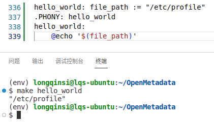

# Makefile

1. 在makefile中定义变量时，如果定义字符串中包含引号，这些引号是会原封不动地作为变量值的一部分的。
   如下例所示：
   
2. 在makefile中使用PowerShell作为脚本语言时，无法使用 \ 作为行连接符，具体可参见stackoverflow.com上的一篇帖子：[Multiline powershell in Makefile](https://stackoverflow.com/questions/74197434/multiline-powershell-in-makefile)。所以如果要在makefile中用PowerShell书写多行脚本，只能写成独立的ps1脚本，在makefile中调用。
3. 在Windows中使用Makefile时，最好不要使用git bash或cygwin，因为在这两种环境中路径分隔符用的是/，而它们调用的工具程序，如jar包、.exe程序等，其内部使用使用的分隔符仍然是\，这种不一致可能带来意料之外的错误，而且往往很难诊断。

