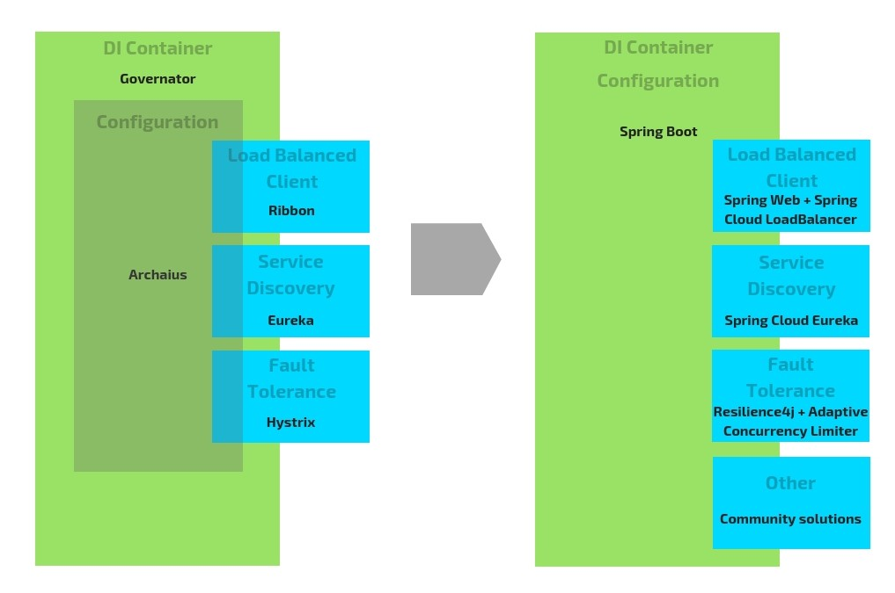
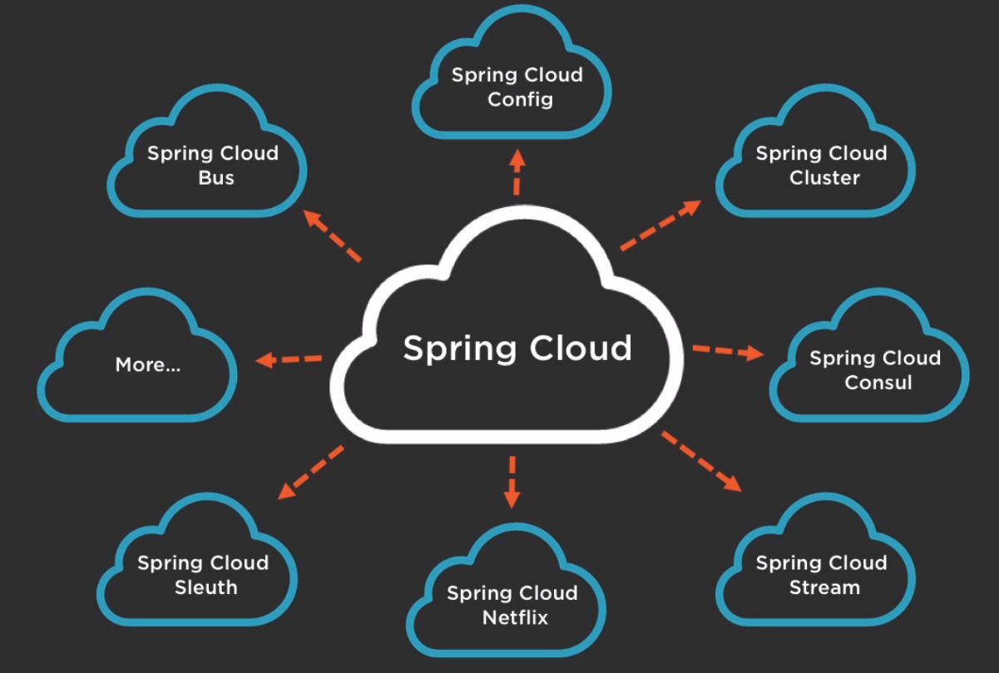
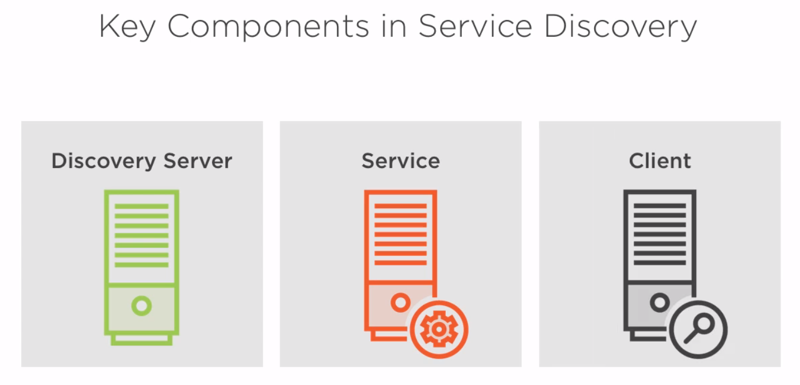

# [技术备忘录](../README.md) | Spring Cloud
## 目录
  1. [Spring Cloud的主要功能](#spring-cloud-functions)
  2. [课程的faq地址](course-faq-url)
  
## 问题
### 1.Spring Cloud的主要功能<a name="spring-cloud-functions"></a>[↑](#top)

* Service discovery - Spring Cloud and [Netfilx Eureka](https://github.com/Netflix/eureka)
  * How do you dynamically find your application services in the cloud at runtime?
* Distributed configuration - Spring Cloud Config Server
  * How to manage common or service-specific configuration in a distributed system?
* Intelligent routing - a gateway service using Spring Cloud and [Netflix Zuul](https://github.com/Netflix/zuul)
  * How to make a distributed system look as if it were a single cohesive system using Intelligent Routing?
* Client-side load balancing - Spring Cloud and Netflix Ribbon
  * How do you distribute load among several instances of the same service?
* Circuit Breaker - Spring Cloud and Netfilx Hystrix
  * To build fault-tolerant applications in the cloud




### 2.课程的faq地址<a name="course-faq-url"></a>[↑](#top)
[course faq](http://dustin.schultz.io/ps-scf/)

### 3.Service Discovery & Eureka<a name="service-discovery-and-eureka"></a>[↑](#top)
* Service discovery provides
  - A way for a service to register itself
  - A way for a service to deregister itself
  - A way for a client to find other services
  - A way to check the health of a service and remove unhealthy instances
    - Each application service need to implement a health check, typically via a REST endpoint. The Service Discovery Server would call that endpoint, and if the health check were to fail, it would remove that instance from its registry.
  
  

  - The Service Discovery Workflow
  
    

    1. Service registers locaction
        > The application service starts up and calls out to the Discovery Server to registers itself. It tells the Discovery Server its location, port, and a service identifier
    2. Client looks up service location
       > A client needs to call the application service, but it doesn't know the location and port of the service, so it needs to ask the Discovery Server. It sends out a request to the Discovery Server and sends along the service identifier.
    3. Discovery server sends back location
       > The Discovery Server knows that based on that service identifier which service you are asking for, and it responds back with the location and the port of that service. 
    4. Client requests service at location
       > The client can request the service at its location.
    5. Service sends response
       > The service can respond back with data. 

  * Discovery Server
    > An actively managed registry of service locations
    > One or more instances (High availability and high scalability)
    * Spring Cloud Eureka Server
      ```xml
      
      ``` 
* Eureka Client
* Eureka Server
* Eureka Instance